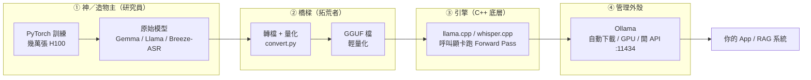

# 用大白話搞懂 Ollama 與 llama.cpp：一個是引擎，一個是包住引擎的外殼

> 這是一篇學習筆記。我一開始以為 **Ollama 跟 llama.cpp 是兩個競爭對手，要二選一**——
> 結果完全搞錯方向，它們其實是「上下層」的關係。我把搞錯的地方原汁原味留下來，希望你不會卡在同一個坑。

> 這篇是上一篇 [Ollama 與 vLLM](/system/ollama-vllm-explained) 的「再往下一層」：上一篇講「工具 vs 模型」，這篇講「外殼裡到底裝了什麼引擎」。

---

## 一句話：Ollama 與 llama.cpp 的差別

**`llama.cpp` 是「引擎」，Ollama 是「包住引擎的外殼」。**

它們不是對手、不是二選一——**Ollama 肚子裡裝的引擎，就是 `llama.cpp`。**

- **`llama.cpp`**：一顆用 C++ 寫的**推論引擎**。負責讀模型檔、呼叫你的顯卡，飛速把「輸入」算成「輸出」。快、省、但很**裸**。
- **Ollama**：把這顆引擎包起來的**管理外殼**。幫你自動下載模型、自動分配 GPU、背景開好 API——一行指令就能用。

> 比喻：**`llama.cpp` 是一顆裸引擎，Ollama 是一台你可以直接發動上路的車。**（這台車到底幫你裝了什麼，下面拆給你看。）

記住這句，因為我一開始就是在這裡搞錯的：**它們不在同一層，是「引擎」與「包引擎的車」。**

---

## 先把整條 AI 流水線攤開（你才知道誰站哪一格）

要搞懂 llama.cpp 和 Ollama 站在哪，最快的方法是把一個模型「從出生到被你用」的整條流水線畫出來。它一共四格：



用一句話描述每一格在幹嘛：

| 角色 | 是誰 | 在做什麼 | 工具 |
|---|---|---|---|
| **① 神（造物主）** | 聯發科、Google 的研究員 | 用龐大 GPU 算力**訓練**出原始模型 | **PyTorch** |
| **② 橋樑（拓荒者）** | 開源社群大神 | 把笨重原始模型**壓縮 + 轉檔**成輕量格式 | Python + `convert.py` → **GGUF** |
| **③ 引擎（底層運算）** | — | 讀 GGUF、呼叫顯卡、飛速**推論** | **`llama.cpp`** / `whisper.cpp` |
| **④ 管理外殼** | — | 把引擎包起來、自動化、開 API | **Ollama** |

llama.cpp 站在**第 ③ 格**，Ollama 站在**第 ④ 格**——它們是相鄰的上下層，不是同一格的競爭者。

---

## llama.cpp 到底是什麼？（裸引擎）

`llama.cpp` 是 Georgi Gerganov 用純 C/C++ 寫的推論引擎。它做的事很單純：

- **讀一個 GGUF 檔**（量化過的模型），
- **呼叫你的顯卡**（NVIDIA 走 cuBLAS、Mac 走 Metal，甚至純 CPU 也能跑），
- **飛速執行 Forward Pass**——也就是「給它輸入、它吐出下一個字」。

> 一個名詞先講清楚：**GGUF** 是現在的模型檔格式，取代了舊的 **GGML**。它把模型**量化**（例如把每個權重從 16 位元壓成 4 位元）——檔案變小、連筆電都跑得動，代價是犧牲一點點精度。像把無損音樂壓成 MP3。

它的優點是**快、省、零依賴**（編譯出來就一個執行檔，不用扛整個 Python 生態）。

但它很**裸**。你直接用 `llama.cpp` 會碰到這些事，全都要自己處理：

- 模型要自己去 Hugging Face 找、自己下載那個 GGUF 檔。
- 啟動時要自己下參數：context 長度、要 offload 幾層到 GPU（`-ngl`）、批次大小……
- 想要 API？要自己跑 `llama-server`、自己記住 port。
- 換一個模型？再走一次上面全部。

這就是「裸引擎」的感覺：**性能滿點，但每個旋鈕都得你自己轉。**

---

## Ollama 到底多做了什麼？（外殼／司機）

先把話講精確：**嚴格來說，Ollama 本身「不是」推論框架，它是一個「模型管理平台」+「API 伺服器」。** 真正幫它算數學、處理神經網路的幕後推手，還是包在它肚子裡的 `llama.cpp`。

> 延續汽車比喻：引擎只專注一件事——**極致運算效能**：跟 CPU/GPU 溝通、把神經網路載入記憶體、瘋狂算矩陣乘法。但它沒有方向盤，普通人很難直接駕馭。Ollama 是用 **Go** 寫的應用程式，把這顆引擎封裝在底層，再幫你加上方向盤、冷氣、導航——你只要「踩油門」。

既然算數學的不是 Ollama，那它在忙什麼？它負責解決所有**系統與工程上的麻煩事**：

```bash
ollama run gemma3:12b     # 一行：自動下載權重 + 配置 + 開對話
ollama serve              # 背景開好 API（OpenAI 相容，連 http://localhost:11434）
```

1. **模型倉庫與下載**：像 Docker 一樣，`ollama run llama3` 就自動連網下載、驗證、儲存模型，還幫你管版本。
2. **記憶體生命週期管理**：決定模型何時載入記憶體、閒置時自動卸載（就是 warm-up 與 `keep_alive` 機制）。
3. **自動化硬體配置（Auto-Offload）**：自動偵測你的硬體、判斷有多少 GPU VRAM，**自動幫你算 `num_gpu`（要 offload 幾層到 GPU）**——你完全不用手動試 `-ngl`。
4. **友善的 HTTP API**：背景開 `localhost:11434`，讓你的網頁 / 後端用簡單 JSON 跟模型對話，而不必在終端機下複雜指令。

> 一句話收束：**推論框架（`llama.cpp`）負責「算」，Ollama 負責「管」。**
> 所以 **Ollama = llama.cpp（引擎）+ 變速箱 + 儀表板 + 自動駕駛**——你要的是「上路」，它讓你不用懂引擎怎麼接就能開。

**一張表收束 ③ vs ④：**

| | **`llama.cpp`（引擎）** | **Ollama（外殼）** |
|---|---|---|
| 它是什麼 | C++ 推論引擎 | 包住引擎的管理工具 |
| 你要自己做的 | 下載模型、設參數、開 server | 幾乎都自動 |
| 用起來 | `./llama-server -m model.gguf -ngl 35 …` | `ollama run gemma3` |
| 適合 | 要極致控制 / 嵌進自己程式 / 邊緣裝置 | 想快速本機跑 / 開 API / 常換模型 |
| 關係 | Ollama **裡面**跑的就是它 | **包**著 llama.cpp |

---

## 那為什麼還需要肥肥的 PyTorch？（訓練 vs 推論）

這是很多人剛碰 `llama.cpp` 會冒出的靈魂拷問：**既然 C++ 引擎這麼快、這麼省，那到底誰還在用龐大又吃資源的 PyTorch + Python？**

答案的核心，是 AI 領域兩個**完全不同的階段**：**訓練（Training）** 與 **推論（Inference）**。

> 用汽車工業打比方：
> - **PyTorch + Transformers ＝ 汽車研發實驗室與兵工廠**（造引擎、改設計、做實驗）。
> - **`llama.cpp` ＝ 量產後直接開上高速公路的跑車**（只負責跑得又快又穩）。

關鍵差別在這：**`llama.cpp` 只會做 Forward Pass（推論）**——給它輸入、吐出輸出。但**「訓練」需要的是 Backpropagation（反向傳播）**，去更新那幾十億個參數的權重，而那是 PyTorch 為之而生的本事。`llama.cpp` 根本沒有這套機制。

---

## 訓練到底在幹嘛？（Forward Pass → Loss → Backprop 的「考試訂正」迴圈）

我一開始以為「訓練 = 把很多書 / 語音資料餵給模型」就好。這個理解**從人類視角看沒錯**，但底層其實還差一個關鍵動作。

想像你把一本《微積分大全》丟給一個完全不懂數學的高中生（未訓練的模型），叫他「吃進去」。他就算把每個字都看過一遍，**也學不會微積分**。真正的學習機制是「**考試與訂正**」。AI 訓練一模一樣。

把「餵一本李白詩集」拆成底層步驟，系統其實在跑一個瘋狂的無窮迴圈：

1. **截取考題（餵資料）**：從書裡抓「床前明月」，把後面的字遮起來當考題。
2. **Forward Pass ＝ 讓模型盲猜**：模型現在是笨蛋（權重是亂數），算完吐出一個荒謬的猜測 👉「下一個字是『**餅**』」。
3. **計算誤差（Loss）＝ 對答案**：翻開書，正確答案是「**光**」。算出「餅 → 光」差多遠，這就是 Loss。
4. **Backpropagation ＝ 拿藤條鞭打訂正**：PyTorch 的黑魔法啟動，往回算微積分，找出是神經網路裡**哪幾個變數**害它猜成「餅」，然後微調：「下次看到『床前明月』，把猜『餅』的機率調低、猜『光』的機率調高！」

**資料是燃料，PyTorch 是引擎：**

- **沒有那堆書 / 語音（標準答案）** → 系統算不出 Loss → 模型不知道錯在哪 → 無法反向傳播。
- **沒有 PyTorch（會算微積分的引擎）** → 你準備十萬本書，模型看完也只會發呆，因為它不知道怎麼「根據書本改自己的腦袋」。

研究員每天的工作，就是把**幾 TB 的資料**源源不絕送進 PyTorch 的「考試與訂正」迴圈，用幾萬張 H100 不眠不休跑上好幾個月。等到模型幾乎每次都能精準猜對下一個字，就「訓練完成」——接著才被轉成 GGUF，交給你用 `llama.cpp` / Ollama 跑推論。

---

## 哪三種人「必須」裝 PyTorch？（而你為什麼不用）

既然推論用 C++ 引擎就好，那 PyTorch 是給誰用的？三種人：

**1. 模型訓練師與微調者（造物主）**
像聯發科工程師開發台灣腔語音模型 `Breeze-ASR-25` 時，**絕不可能**用 `whisper.cpp`——那只能做推論。要訓練／微調幾十億參數的權重，需要極複雜的反向傳播，而 PyTorch 就是為這個而生：吃進幾萬小時台灣語音、算誤差、更新權重。

**2. AI 演算法研究員（科學家）**
想改 Whisper 底層架構（例如加一層新的 Attention）？
- **用 Python（PyTorch）**：程式碼是動態的，改架構大概 10 行、馬上跑跑看。
- **用 C++（whisper.cpp）**：你要面對指標、記憶體分配、底層 CUDA 核心的 C++ 改寫——驗證一個想法的成本太高了。

**3. 需要「格式轉換」與「最新模型」的人（拓荒者）**
你今天能爽用 GGUF，是因為**有人先在 Python 環境裡幫你轉好檔了**：
- Hugging Face 上的模型，原始格式都是 PyTorch / Safetensors。
- 要變成輕量 GGUF，得先在裝有 PyTorch 的環境跑一段 `convert.py`，把參數壓縮、量化，才產出你能餵給 `llama.cpp` 的檔案。
- 而且當 Google / OpenAI 開源一個**全新架構**時，**Day 1 只有 Python（Transformers）支援**。C++ 社群（如 Georgi Gerganov）通常要熬夜加班一兩週，才能把新架構用 C++ 刻出來。

**而你不用**——因為你的角色是**應用程式開發者 / 系統部署者**，目標是「把現成模型以最低延遲、最少資源塞進你的系統」，不是去發明或訓練模型。

---

## 我一開始搞錯的幾件事

**誤會一：以為 Ollama 和 llama.cpp 是對手、要二選一。**
不是。**Ollama 包著 llama.cpp**——一個是引擎、一個是包引擎的車。你用 Ollama 的時候，底層跑的就是 llama.cpp。

**誤會二：以為 Ollama 自己寫了一套推論引擎。**
基本上沒有。它的核心推論是建在 `llama.cpp` / ggml 上的；Ollama 的價值在**外面那層**——下載管理、GPU 自動配置、API 封裝、Modelfile。

**誤會三：以為 Ollama 什麼模型都能管（包含語音）。**
不行。**Ollama 目前肚子裡只裝 `llama.cpp` 這顆引擎**，專門管大型語言模型（LLM）和視覺模型。負責語音辨識的 `whisper.cpp` 目前**還在車外獨立跑**（你得自己寫腳本呼叫它），官方還沒把它收編。所以一個「語音 RAG」系統，常常是 `whisper.cpp`（語音轉文字）在車外、Ollama（跑 LLM）在車內，兩台引擎並用。

**誤會四：以為有了快又省的 C++ 引擎，就不需要 PyTorch 了。**
推論不需要，但**訓練、微調、改架構、轉檔**都還是要 PyTorch。C++ 引擎只會 Forward Pass，不會 Backprop。

**誤會五：以為「訓練 = 把書 / 語音餵給模型」就好。**
光餵不夠。要「**考試 → 對答案 → 訂正**」（Forward Pass → Loss → Backprop）的無窮迴圈，模型才學得會。資料是燃料，PyTorch 才是那台會訂正的引擎。

---

## 什麼時候用哪個？

- **想在自己電腦上快速跑、常換模型、要一個現成 API** → **Ollama**（一行 `ollama run` 就開始）。
- **要極致控制、把引擎嵌進自己的 C++ 程式、跑在邊緣裝置、想自訂量化或特殊參數** → **直接上 `llama.cpp`**。
- **要讓很多人同時用、追求生產級吞吐量** → 那是另一個戰場，看上一篇 [Ollama 與 vLLM](/system/ollama-vllm-explained)。
- **要訓練 / 微調 / 轉檔 / 改架構** → 回到 **PyTorch + Transformers**。

懂得「**什麼時候只要外殼、什麼時候要裸引擎、什麼時候得搬出整個實驗室**」，比硬背名詞值錢得多。

---

## 結語

把一句話再說一次：**`llama.cpp` 是引擎，Ollama 是包住引擎、幫你自動發動上路的車——它們不是對手，是上下層。** 而往上追，這顆引擎跑的模型，是研究員用 PyTorch「考試訂正」幾個月訓練出來、再被拓荒者轉成 GGUF 才到你手上的。

整條開源 AI 之所以能跑得這麼順，靠的就是這條終極公式：

> **模型轉換格式 ➔ 交給 C++ 引擎跑 Forward Pass ➔ 外層套一個管理工具來調用。**

而這些概念真正從「看過」變成「懂」的那一刻，不是讀文章的時候——是你**親手 `ollama run`、看著一個跑在自己顯卡上的模型開始回話**、然後好奇「它底層到底在呼叫什麼」、一路挖到 `llama.cpp` 的那一刻。
