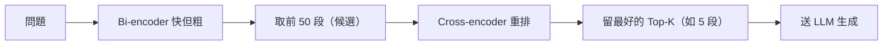

# 用大白話搞懂 RAG：從一堆誤會到真正理解

> 這是一篇學習筆記。我把自己從「以為懂、其實全錯」到「真正搞懂」的過程整理出來，
> 保留了我一開始搞錯的地方——希望大家不會被同樣的地方卡住。

---

## 一句話：RAG 在解決什麼問題

大型語言模型（LLM）很聰明，但它有兩個毛病：

1. **它不知道「你的」知識**——你公司的內部文件、你的個人筆記、或它訓練完之後才發生的事。
2. **它會一本正經地亂編**（這叫「幻覺」hallucination）。

**RAG（檢索增強生成）就是來補這兩個洞的**：在讓 LLM 回答之前，先去資料裡**撈出相關的段落**，再叫它**根據這些段落回答**。

把 **R-A-G** 三個字拆開看，整個架構就出來了：
- **R**etrieval（檢索）：去找出相關資料——**這是向量資料庫做的**。
- **A**ugmented（增強）：把找到的資料塞進給 LLM 的指令裡。
- **G**eneration（生成）：LLM 根據這些資料寫出答案——**它只負責最後這一步**。

記住最後那句，因為我一開始就是在這裡搞錯的，RAG並不會訓練資料，它只是檢索資料，把資料交付給LLM，讓它去寫答案。

<figure>
  
  <figcaption>RAG 全景：三階段（檢索 → 增強 → 生成）、六個零件、兩段式檢索，一張圖看懂</figcaption>
</figure>

---

## 整個流程：其實是「兩個階段」

理解 RAG 的關鍵，是把它拆成**完全分開的兩個階段**。

### 階段一：建索引（事先做好，使用者還沒來）

```
你的文件 → 切塊 → 每段轉成向量 → 存進向量資料庫
```

這一步在使用者問問題**之前**就做好了。它把你的知識「整理上架」。

### 階段二：查詢（使用者問問題時才跑）

```
使用者的問題
 → 把「問題」也轉成向量
 → 拿去向量庫，找出最相關的幾段（top-k）
 → （重排序，把最相關的提到最前）
 → 把「問題 + 這幾段」組成一段指令（prompt）
 → 交給 LLM，根據這幾段寫出答案
```

### 誰在指揮這一切？（這點超重要）

我一開始以為是「LLM 在跑這整個流程」。**錯。真正的指揮者是自己寫的程式碼。**

| 步驟 | 是「誰」做的 |
|---|---|
| 收到使用者的問題 | **你的程式碼** |
| 把問題轉成向量 | embedding 模型（你的程式碼呼叫它） |
| 拿向量去搜、撈回相關段落 | 向量資料庫（你的程式碼呼叫它） |
| 把「問題 + 段落」組成 prompt | **你的程式碼** |
| 讀 prompt、寫出答案 | LLM（你的程式碼呼叫它） |
| 把答案回給使用者 | **你的程式碼** |

**LLM 只負責倒數第二格，其他全是程式碼在串。** 對寫過後端的人來說，這就是「呼叫一個 API、拿結果、再呼叫下一個」而已——沒有魔法。

---

## 把每個零件講清楚（白話 + 比喻）

**Embedding（向量）= 意思的 GPS 座標。**
把一段文字壓成一串數字，讓「意思相近」變成「數字相近」。為什麼要這樣？因為電腦沒辦法直接比「兩段話像不像」，但可以比「兩個座標近不近」，想像它是平面的XY軸，實際不是會是多維的方式儲存，意思相近的文字都會在附近，就可以假設認定它們是接近的。

**向量資料庫 = 一張存滿座標的地圖。**
它做兩件事：存所有文件的座標、並且能**快速找出離某個座標最近的幾個**。它用一種叫 ANN（近似最近鄰）的技術，所以就算存了幾百萬段，搜尋還是毫秒級——這也是為什麼「資料變多，查詢速度卻不會被拖垮」。
- **Top-k**：撈回最相近的前 k 段。top-5 就是最近的 5 段。

**切塊（Chunking）= 把長文件切成小段。**
為什麼要切？因為 LLM 一次能讀的量有限，塞不下整本書。
- 切太大：雜訊多、浪費空間。
- 切太小：一個完整的意思被切斷，撈回來只是半句、缺上下文，反而答不好。
- **Overlap（重疊）**：讓相鄰兩段共用一點內容，避免把意思切斷在邊界。

**檢索其實有兩段。**
- 第一段用 **bi-encoder**：問題和文件分開各自算向量再比相似度，**快，但粗**。先快撈一批（例如 50 段）。
- 第二段用 **cross-encoder 重排序（re-ranking）**：把問題和段落綁在一起讀、判斷真正相關度，**準，但慢**，只對那 50 段精排、留最好的 5 段。
- 為什麼不一開始就用準的？因為它太慢、不可能跑整個資料庫。所以「**快撒網 + 準挑選**」，但要注意re-ranking不代表會變更好，有時候也可能有反效果，還是要以評估出來的結果決定。



**LLM 生成 = 一個只讀「你貼給它的東西」的寫手。**
它寫答案的方式是**一次預測一個字**：看完你的指令 + 問題 + 那幾段，預測「下一個字最自然是什麼」，一路寫到完。因為你把相關段落塞進去了，它的每個字都被那些段落牽著走，所以答案**有依據（grounding）**、比較不會亂編。

---

## 我一開始搞錯的五件事

**誤會一：以為「LLM 負責檢索」。**
不是。檢索是**向量資料庫**做的相似度搜尋，LLM 完全不碰。LLM 只在最後寫答案。

**誤會二：以為 RAG 會「訓練」我的文件或模型。**
不會。整個 RAG **沒有任何訓練**。只是把文件**轉成向量存起來**、然後**呼叫現成模型**而已。embedding 模型、重排器、LLM——全是別人訓練好的，你像呼叫函式一樣用它們。
（真的會「改變模型」的事叫 **fine-tuning（微調）**，那是另一個技術，RAG 沒在做。）

**誤會三：以為 LLM 是「大腦」、在指揮整個流程。**
不是。指揮者是**你的程式碼**，LLM 跟向量庫一樣只是被呼叫的工具。

**誤會四：以為檢索會把文件「篩掉」、資料庫會越來越少。**
不會。檢索是「**搜尋**」不是「丟棄」。像圖書館：你借 5 本書來看，書還在架上，館裡一本都沒少；下一個問題又是對「整座館」重新搜一次。資料庫只增不減（除非你手動刪）。

**誤會五：以為 RAG 是為了對付 LLM 的「隨機性」。**
不是。那是另一個旋鈕：
- **想要答案知識正確、有依據** → 這是 **RAG** 管的。
- **想要答案每次措辭一致** → 這是 **temperature**（一個 LLM 設定，調到 0 就幾乎固定）管的。


---

## 怎麼知道我做得好不好？（評估）

調了半天 chunk 大小、加了重排器——怎麼知道有沒有變好？**用數字量，不要用感覺。**

**第一步：先有「標準答案」。** 建一份清單，每題標好「正確答案在哪一段」。
建這份清單最快的方法：把一段文件丟給 LLM，叫它「針對這段出一個問題」，你再人工確認審核我的話會再用grill me去對齊一下——這樣就免費得到一堆「已知正確來源」的測試題。（這招叫**合成資料生成**。）

**第二步：算兩個分數。**
- **Hit Rate@k（命中率）**：正確段落**有沒有**出現在前 k 名。有=1、沒有=0，全部平均。看「抓到沒」。
- **MRR（平均倒數排名）**：正確段落**排第幾名**，取 1÷名次（第 1 名=1.0、第 2 名=0.5…沒抓到=0），再平均。看「排得前不前」。


**第三步：用它做決策。** 跑一次記數字 → 改一個設定（換切法、加重排器）→ 再跑 → **比數字、選贏的**。這就是「用數據做工程決策」，而不是憑感覺。

---

## 一個 RAG 專案，實際上是怎麼「跑」起來的？

很多人以為 RAG 是「寫完就好」，其實它是一個**會一直循環的過程**。用「煮一道菜」來想最清楚：

1. **想清楚要煮什麼**：這道菜給誰吃、要解決什麼。先把食材（文件）備齊。
2. **先照基本食譜煮一鍋**：別一開始就追求完美，先煮出一鍋「能吃的」（最簡單能跑的版本）。
3. **找試吃員、定一個「該有的味道」**：這就是你的**評估集**——一份「這道菜對的味道是什麼」的標準。沒有它，你只能靠感覺，永遠不知道有沒有變好。
4. **改善迴圈（整個專案的核心，你會轉很多很多次）**：

   > **試吃 → 調一樣 → 再試吃 → 比較 → 決定**
   > 嚐一口（跑 Hit Rate/MRR），覺得不夠味 → **只多放一點鹽**（只改一個設定：切法、換 embedding、加重排器…）→ 再嚐一口 → 比剛剛好吃嗎？好就留著、不好就倒回去 → 再調下一樣。

   這裡有個煮菜人都懂的鐵則：**一次只調一樣**。你要是同時加鹽、加糖、轉大火，這鍋就算變好吃，你也不知道是誰的功勞、下次也複製不來。改 RAG 一模一樣——**一次只改一個變數**，才知道是哪個動作讓數字變好。
5. **不只鹹淡，整道菜好不好吃**：Hit Rate/MRR 量的是「有沒有夾對料」（檢索）；但「整道菜的味道」（最終答案品質）是另一種更主觀的評估，要另外顧。
6. **上菜**（系統上線）。
7. **開店之後還要繼續調**：客人（真實使用者）點了菜、有人嫌某道不好吃——你把這些回饋收集起來，**加進你的「該有的味道」清單**，然後回到改善迴圈再調一輪。

所以評估**不是「煮完才回頭嚐一次」**，它是你**從頭到尾手裡那支湯匙**：開發時不停試吃、開店後定期回嚐。一個好的 AI 系統，是「持續量、持續調」調出來的，不是一次煮好的。

---

## 幾個實用的設計判斷

**什麼時候才需要 RAG？它不是萬靈丹。**
- 知識是**私有 / 很新 / 很冷門** → LLM 真的不會 → **一定要 RAG**。
- 知識是**公開的**（它本來就會） → 這時 RAG 的價值不是「教它新東西」，而是：**綁定特定來源、答案可溯源、細節更準確、控制要用哪個流派**。
（懂得「什麼時候不需要某個技術」，比硬上更聰明。）

**RAG vs Fine-tuning。**
RAG 給**外部知識**、適合知識會變、要溯源；fine-tuning 改**模型本身的行為/格式/語氣**。多數情況先用 RAG，需要時再加輕量微調。

**一個資料庫 vs 多領域分開？**
領域完全不相關（股票 vs 旅遊）→ 分開、或放一起但用 **metadata 標籤過濾**。領域相關 → 放一起反而互相支援。

**放原文還是放摘要？**
預設放**原文**（切塊後存）——它是忠實的事實來源。摘要是加工過的二手資料，**漏了或扭曲了就再也救不回來**（garbage in, garbage out）。切塊本身已經幫你「聚焦」了，不需要靠摘要換聚焦。不確定就兩種都跑評估、比數字。

---

## Web search 也是 RAG——只是換了檢索器

很多人以為 web search 是 RAG 的「對手」，其實**它是 RAG 的兄弟**。

LLM 做 web search 時，流程一模一樣：你的問題 → 去網路搜 → 撈回幾個網頁片段 → 塞進 context → 根據它們生成答案。這就是 R-A-G，只是把「R 那一步的檢索器」從向量庫換成了搜尋引擎而已。

（Web search 一樣是個工具，由系統去呼叫——LLM 還是看不到它沒被餵進來的東西。）

差別只在「撈哪裡」：

- **Web search** 撈的是公開網路：適合公開、最新、廣泛的資訊。
- **RAG（查你自己的向量庫）** 撈的是你的私有／內部資料——而這些根本不在公開網路上。

---

## 中文 RAG 的眉角：錯字、變體、同義詞怎麼辦？

做中文 RAG 會遇到英文沒有的坑——繁簡、形近字、還有「明明是同一個意思卻寫成不同詞」。但別緊張，先把情況分成兩種，就清楚了。

**情況一：同義的變體（像「甚麼／什麼」）→ 其實不用管。**
因為檢索比的是**語意**不是字面，好的多語 embedding 模型會把「甚麼」和「什麼」算成幾乎一樣的向量，照樣撈得到。這正是向量檢索比關鍵字搜尋強的地方——它對用字的小變化是**容忍**的。

**情況二：寫成「不同意思的詞」（像「回條」其實想表達「回調」）→ 這要處理。**
模型不知道「在你這裡回條＝回調」——這是**你的私有約定，有時候會偷懶不想換字**，不是世界通用知識。所以得告訴系統這個等價關係。但重點是：**不是去訓練模型**，而是加一層你自己控制的「正規化」。

做法是維護一張**別名對照表**，然後**兩端都轉成同一個標準詞**：

- 別名表：`回條 → 回調`
- **建索引時**：文件裡的「回條」先換成「回調」再 embedding。
- **查詢時**：使用者打「回條」先換成「回調」再 embedding。
- 結果：兩邊都變「回調」，語意對上了，自然撈得到。


最關鍵的：**正規化一定要「兩端都做」**。只改查詢、不改文件（或反過來），兩邊還是對不上——這跟「索引和查詢要用同一個 embedding 模型」是同一個道理：**兩端要一致**。

實務上：這張表不用一開始就列完，**從真實的失敗案例慢慢補**；明確固定的對應用字典替換就好，又快又可靠；最後一樣——**把打錯字／同義詞的問題放進評估集，量一下到底有沒有傷到、你的修法有沒有效**。

---

## 結語

RAG ：**會把文件跟問題都轉成向量，文件會切塊轉成向量類似座標存起來、用問題去找最近的幾段、再把這幾段交給一個只讀你給它的東西的寫手。** 沒有訓練，指揮者的人是自己的程式碼。

而這些概念真正從「看過」變成「懂」的那一刻，不是讀文章的時候——是你**親手把這條 pipeline 跑起來**、看著檢索回的段落出現在螢幕上的那一刻。
