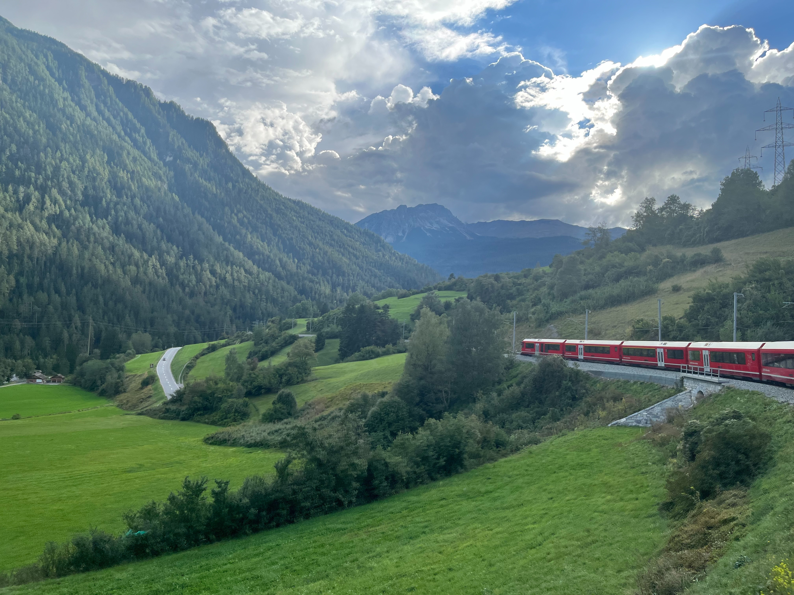

# 旅行照片畫廊示例

這個頁面展示了旅行照片畫廊的效果。

## 使用 Vue 組件的圖片畫廊

<TravelGallery 
  :images="galleryImages" 
  :titles="imageTitles" 
  :descriptions="imageDescriptions" 
/>

## 行程亮點

### 松本 上高地

冬天，上高地雖然封山，但請嚮導帶領還是可以入山健行，田代池，雖然不大但陽光灑落到水池跟空氣的樣子，配著山景也別有風味。

### 東京 東京大學

上野附近的東京大學，幅員廣大擁有許多歷史感的建築，漫步校園裡可以花上數個小時，其中赤門是在災難中倖存下來的珍貴歷史建築。

### 瑞士 蘇拉瓦

伯爾尼納快車是瑞士的三大著名景觀列車，連接瑞士庫爾與波斯基亞沃及義大利蒂拉諾，穿梭在阿爾卑斯山脈中，其中的美無法言喻。

