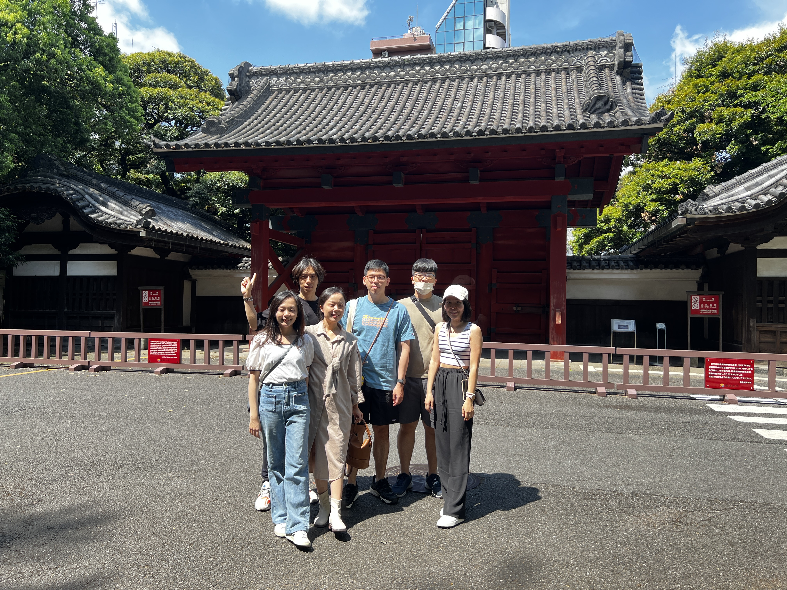

# 日本旅行紀錄

  

    旅行時間
    2023年4月
  

  

    旅行城市
    東京, 京都, 大阪, 奈良
  

  

    旅行主題
    文化體驗, 美食探索, 城市觀光
  

## 旅行概況

日本，一個傳統與現代完美交融的國度，充滿令人驚嘆的文化、科技和自然之美。這裡有著迷人的櫻花季節，美麗的富士山風景，以及充滿活力的東京和歷史悠久的京都。

我的日本之旅橫跨了東京的現代都市，京都的古老寺廟，大阪的美食文化，以及奈良的自然風光。每一個地方都給我留下了深刻的印象。

## 直接 HTML 標籤引用的圖片

以下是使用直接 HTML 標籤的圖片引用方式：

  
  

## 引入模塊方式的圖片

以下是使用 import 引入圖片的方式（與您之前成功的案例相似）：

<ImportedGallery :images="importedImages" />

## 相對路徑引用的圖片

以下是使用相對路徑的圖片引用方式（使用我們創建的新組件）：

<GallerySwiper :images="japanImages" />

## 行程亮點

### 東京都市探索

東京是一座充滿活力的國際大都市，這裡有著高聳的摩天大樓、先進的科技和豐富的購物體驗。淺草寺、東京鐵塔、秋葉原電器街、澀谷十字路口等都是不容錯過的景點。

### 京都古寺與文化

京都作為日本的古都，保留了大量的傳統寺廟和庭園。金閣寺、清水寺、伏見稻荷大社的千本鳥居都是我行程中的重點。在這裡，你可以感受到濃厚的日本傳統文化氛圍。

### 大阪美食之旅

大阪被稱為「日本的廚房」，這裡有著豐富多樣的美食。從街頭小吃到高級料理，大阪都能滿足你的味蕾。章魚燒、大阪燒、拉麵、壽司都是必嚐的美食。

### 奈良公園與鹿群

奈良公園是日本著名的景點，這裡有許多野生鹿自由漫步。這些友好的鹿被視為神的使者，遊客可以購買鹿仙貝餵食。公園內還有許多歷史悠久的寺廟，如東大寺。

## 實用信息

### 最佳旅行季節

- **春季 (3-5月)**: 櫻花季節，天氣宜人
- **秋季 (9-11月)**: 紅葉時節，風景優美
- **冬季 (12-2月)**: 滑雪季節，特別是北海道地區
- **夏季 (6-8月)**: 祭典活動多，但天氣炎熱潮濕

### 交通方式

日本擁有世界上最發達的公共交通系統之一。JR鐵路通票（Japan Rail Pass）可以提供無限制的JR線路使用權，非常適合跨城市旅行。

### 美食推薦

- 壽司與刺身
- 拉麵
- 天婦羅
- 章魚燒
- 大阪燒
- 日式咖哩

## 旅行心得

日本是一個充滿魅力的國家，這裡的人們友好有禮，環境整潔有序，文化底蘊深厚。無論是喜歡現代都市還是傳統文化，日本都能提供豐富多樣的旅行體驗。語言可能是一些遊客面臨的挑戰，但透過簡單的英語和肢體語言，大多數情況下都能順利溝通。

對於初次訪問日本的遊客，我建議先從東京開始，然後沿著「黃金路線」—東京、京都、大阪進行旅行，這樣可以體驗日本的不同面貌。

